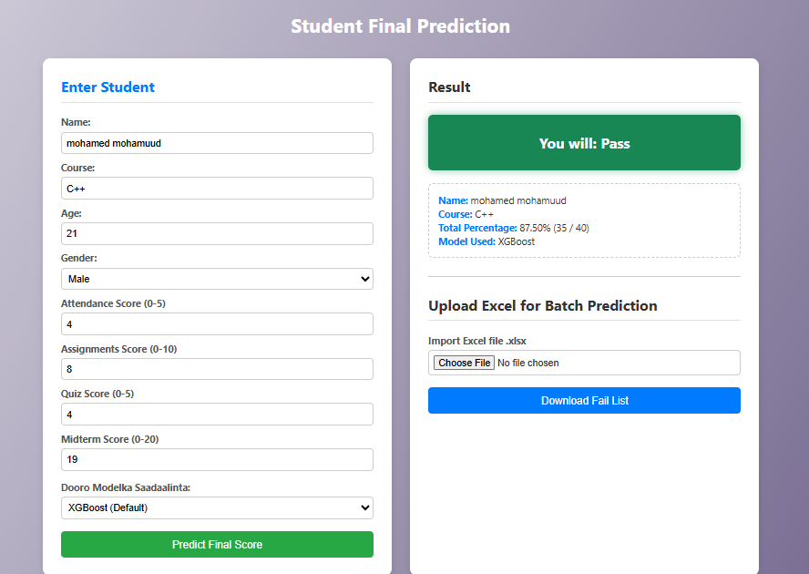
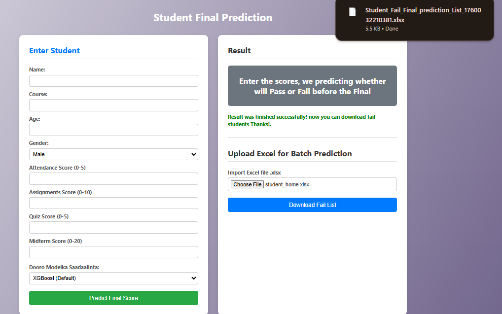
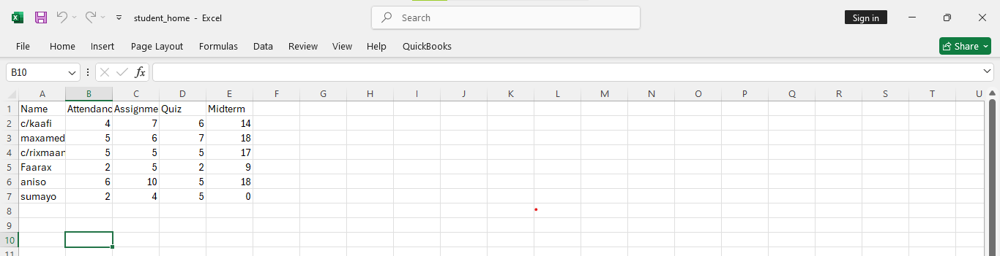
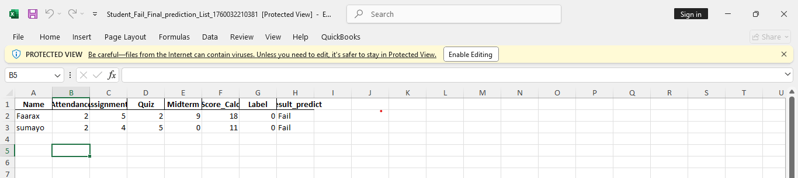
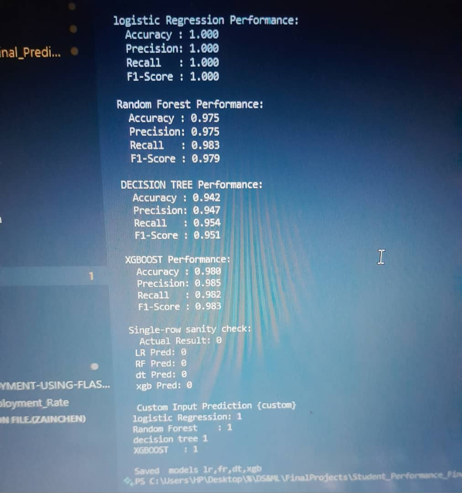
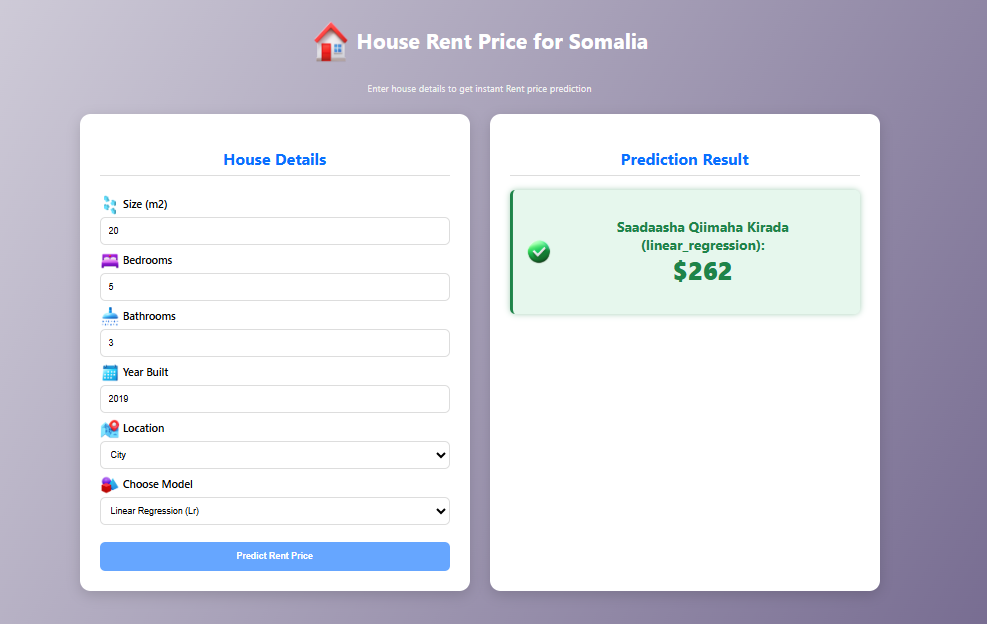
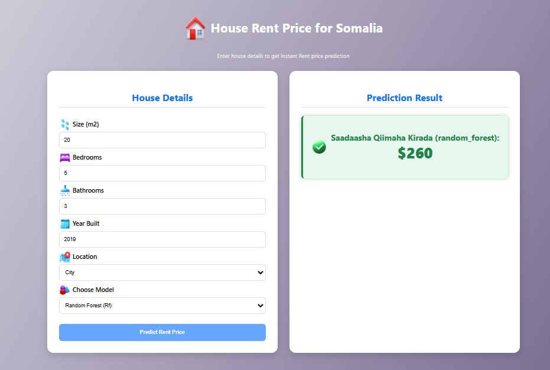

# 📖 Student_Final_Prediction -- ML Workflow

## 1: Problem definition

 **student final prediction** = hadafka wa in la sii sadaalin karo final ka ardeyga si maamulayaasha ardeyda liita muraajico u sameyan kuwa top ku jira la abaal mariyo, kuwa dhexe na la dhiiri galiyo, wana in xog cusub aqbali karaa, project gu waana Supervised qeybta Classfication.

### 2: Data collection

Dataset ku waa 1k+ ardey ah, 9 columns 8 ka mid ah waa **feutures** 1 waa **label**

### 3: Data preprocessing

waxan ka saaray khaladaadka, meelaha banan oo aan buuxiyey, duplicate, iqr_function, feauture engineering, One Hot Encoding, save the scaler and training features, saved dataset

### 4: check images

###### single person check

###### upload file

###### before

###### after

### 5: Model selection

* Ka fiiri dhowr algorithm oo ku habboon haddii final score tiro yahay: Linear Regression, Random Forest Regressor, XGBoost) si aan u helo pass/fail.
* Samee **train/test split** (e.g., 80/20).

### 6: Model evaluation

* Train/test split, scaler
* random forest, logistic regression, decition tree, xgboost
* single row sanit check
* custom inputs
* Metrics:
  * Classification → Accuracy, Precision, Recall, F1-score
* saved models

---

### 7: Deployment & usage

* API (Flask) si xog cusub loo galiyo loona helo prediction
* frontend HTML + CSS + JS si macallimiinta ama maamulka si fudud uga arkaan

### 8: Monitoring & improvement

* Si joogto ah u cusbooneysii modelka marka xog cusub timaado
* Ka war hay haddii performance uu hoos u dhaco model drift
* kusoo daray feutures sida in excel lasoo galin karo

### 9: Who uses it?

managers to decide whether students who fail the final exam at a school, university or college

### 10: 💡 How is it used?

Fadlan excel file kaaga columns kaan wa in ku jiran    **Attendance  Assignments  Quiz  Midterm**

weliba sida ay u qoran yihiin, **lakiin wax kale waad kuso darsan karta sida  name,age,gender,id**

**kadibna soo download gareyso list kaliya ah fail examka dhici raba finalka si aad uga hortagto oo aad murajico ugu sameyso**

### 11: 💡scores/ dhibcaha

1: Attendance = 0 ilaa 5                 2: Assignments = 0 ilaa 10

3: Quiz = 0 ilaa 5                           4: Midterm = 0 ilaa 20

* totalku waa 40          maadama u finalka yahay 60

---

## 12: 🤖 Models

waxan ku toobaray:

- **logistic Regression**
- **Random Forest**
- **decition tree**
- **XGBoost**

**Saved models:**

- `modeles/lr_model.joblib`
- `modeles/rf_model.joblib`
- `modeles/ds_model.joblib`
- `modeles/rf_model.joblib`

---

### 13: Working API deployment

---

## 14: 🚀 Usage

### Run via API

Start Flask API:

###### Send POST request

http://localhost:8000/predict?model=lr
http://localhost:8000/predict?model=rf
http://localhost:8000/predict?model=df
http://localhost:8000/predict?model=xgb

---

###### Example JSON input:

{
  "Attendance": 4
  "Assignments": 8  
  "Quiz": 5
  "Midterm": 12
}

###### Example response:

{
  "model": "logistic regression",
  "Total_score": 29,
  "prediction_result": fail
}

{
  "model": "XGBoost",
  "Total_score": 29,
  "prediction_result": pass
}

---

# 🏠 House Rent Prediction

*Welcome! Machine Learning Project to Predict House Prices*

## 📖 Description

project gan waa predict house rent based on features such as square, number of bedrooms, bathrooms, year built, and location

waxan ku toobaray **Linear Regression** and **Random Forest** models kadibna waxan ku xiray frontend HTML, CSS, JS

##### tijabo:

###### Linear Regression(lr)

###### Random Forest(rf)

## - 📊 Dataset

- data waa clean waana la  preprocessed gareyey
- ku  saved gareyey: `dataset/house_l0000_Clean_dataset.csv`

---

## 🧾 Features

Main features used for prediction:

| Feature            | Description                                    |
| ------------------ | ---------------------------------------------- |
| Size_sqft          | cabirka ku fadhiyo                             |
| Bedrooms           | tirada qolalka                                 |
| Bathrooms          | tirada suuli yada                              |
| YearBuilt          | sanadka la dhisay                              |
| Location           | meesha u ku yaal (City, Suburb, Rural)        |
| HouseAge           | inta sano uu jiro gurigaas ma cusayb mise duug |
| Rooms_per_1000sqft | celceliska qolalka                             |
| Size_per_Bedroom   | cabirka qolalka                                |
| Is_City            | magaalo ma ku yaal ? (1=City)                  |

## 🤖 Models

waxan ku toobaray:

- **Linear Regression**
- **Random Forest Regressor**

**Saved models:**

- `modeles/lr_model.joblib`
- `modeles/rf_model.joblib`

---

## 🧹 Preprocessing Steps

1. **Handling missing values (sixida waxa maqan ):**
   - Size_sqft → median
   - Bedrooms → mode
   - Location → mode
2. **Remove duplicates(ka saar waxa 2 jeer so labtay)**
3. **IQR capping** for Price and Size_sqft
4. **One-hot encoding** for Location
5. **Feature engineering:** HouseAge, Rooms_per_1000sqft, Size_per_Bedroom, Is_City
6. **Feature scaling:** StandardScaler applied to numerical features

---

## 📈 Evaluation

- RMSE
- MAE
- R² Score

---

## 🚀 Usage

### Run via API

Start Flask API:

###### Send POST request

http://localhost:8000/predict?model=lr
http://localhost:8000/predict?model=rf

###### Example JSON input:

{
  "Size_sqft": 2000,
  "Bedrooms": 3,
  "Bathrooms": 2,
  "YearBuilt": 2010,
  "Location": "City"
}

###### Example response:

{
  "model": "linear_regression",
  "prediction": 230000.0
}

{
  "model": "random_forest",
  "prediction": 250000.0
}
